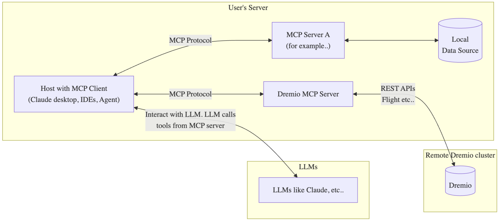
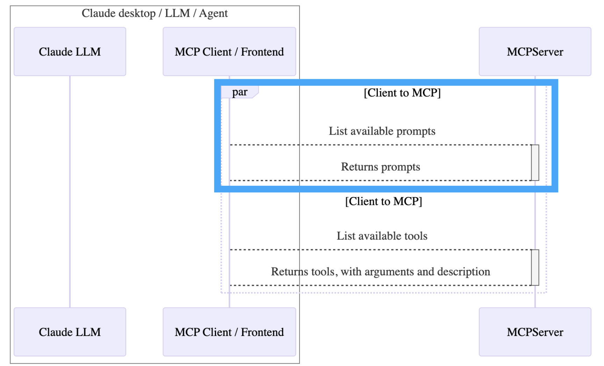
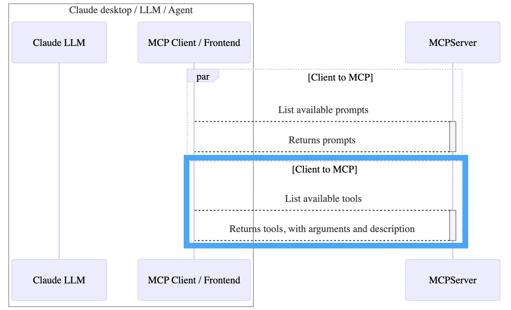
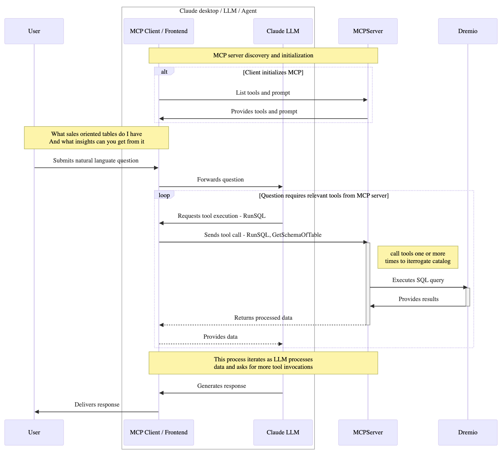
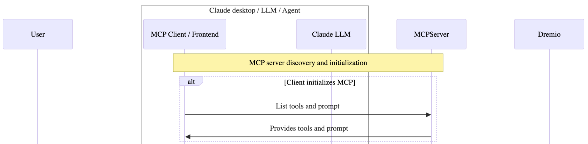
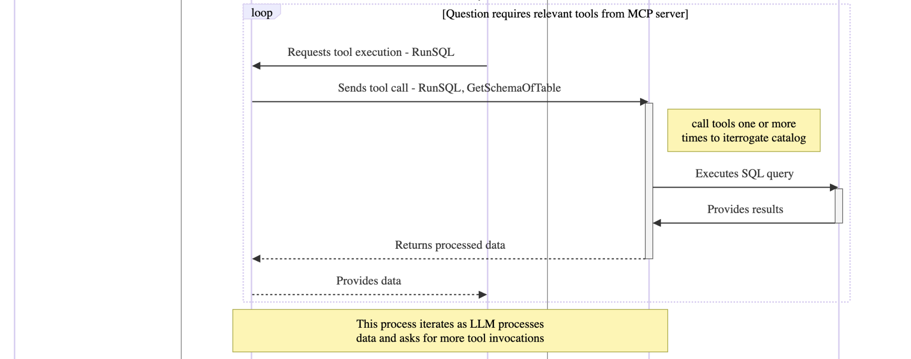
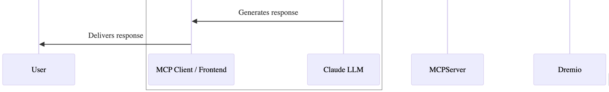

# Overview of Dremio MCP Server

## Dremio MCP GitHub

The Dremio MCP Server implements the Model Context Protocol (MCP) to create a standardized interface between large language models (LLMs) and the Dremio data platform. This architecture enables seamless integration between LLMs and Dremio's capabilities, allowing for natural language interactions with data and analytics workflows.

The Dremio MCP Server is available at https://github.com/dremio/dremio-mcp.
This MCP Server is python based so the only prerequisite the package manager uv.
There are two configurations necessary before the MCP server can be invoked.
- The server config file: This covers the details of connecting and communicating with Dremio.
- The LLM config file: This covers configuring the LLM app to make it aware of the MCP server.

For detailed configuration and integration details, settings, and files, please refer to MCP Server Documentation.

## Dremio MCP Architecture

Consider the detailed architecture diagram below. The Dremio MCP Server is designed to coexist with other MCP clients that are running within your ecosystem. An MCP client may engage with multiple MCP servers with the Dremio MCP Server interacting with Dremio via existing Dremio communication protocols.



## Dremio MCP Server Discovery

**Prompt Discovery**
1. Client requests available prompts from the MCP server.
2. Server returns specialized prompts for different use cases.
3. Prompts are cached for future use.



**Tool Discovery**
1. Client requests available tools from the MCP Server.
2. The server returns tool definitions including:
- Tool names and descriptions
- Required arguments and types
- Expected return values
3. Tools are registered with the LLM for use.



# Dremio MCP Server Interaction Flow

The following diagram illustrates the detailed interaction flow between components that you will step through in the following section.



## Dremio MCP Server Interaction Step Through

**Initialization and Discovery**

1. The MCP client discovers available MCP servers.
2. Each server provides its capabilities (tools) and prompts.
3. The system establishes connections and validates access.

The MCP server acts as the middle layer between the frontend (user) and the backend tools. It ensures that the necessary tools and functions are available for Claude LLM to execute. This step involves making the server ready to handle requests and interact with the data sources (like Dremio) when required.



**User Question Analysis**
1. The user submits natural language questions, in this example regarding sales insights. 
2. The MCP client/frontend receives the query from the user and forwards to LLM for processing.
3. The LLM analyzes the question and determines that the question requires certain tools to be executed.

The query may involve multiple steps or require access to databases, which is why the query is forwarded for further processing by the LLM. The LLM is responsible for interpreting the query, determining what the user wants, and determining which tools are needed to gather the relevant data.


**MCP Executes Tools**
1. The tools are executed through the MCP protocol.
2. Dremio executes SQL queries as per tool execution.
3. The LLM may make multiple tool calls to gather complete information.
4. Each tool call is handled independently.

This loop continues until the processing plan as designed by the LLM is complete. In this case, the LLM requests the execution of the RunSQL and GetSchemaOfTable tools. The schema of the table is important for identifying the relevant columns and data types that will be used in further SQL queries. The RunSQL tool allows execution of SQL queries to retrieve the necessary data. Dremio is responsible for executing the SQL queries, retrieving the requested data from its data catalog (e.g., sales-related tables), and returning the results to the MCP server.



**MCP Prepares and Delivers Results**
1. The results are accumulated and synthesized into a final response.
2. The results are sent back to the user.

Once sufficient data has been gathered and processed, the LLM generates a final response based on the user’s original query. The LLM uses the processed data to create an accurate, coherent answer. The LLM uses its natural language processing capabilities to synthesize the data into a format that is understandable and relevant to the user. The final response, generated by the LLM, is sent back to the MCP client/frontend, which delivers it to the user.



# Dremio MCP Server Tools

## Dremio MCP Tool Types

The dremioai.tools package provides a collection of tools for interacting with and analyzing Dremio clusters. These tools are designed to work with the Model Context Protocol (MCP) server and can also be integrated with other LLM frameworks if needed.

Tools are categorized into different types using the ToolType enum:
- **FOR_SELF**: Tools for introspecting Dremio cluster and its usage patterns
- **FOR_PROMETHEUS**: Tools supporting Prometheus stack setup in conjunction with Dremio
- **FOR_DATA_PATTERNS**: Tools for discovering data patterns analysis using Dremio's semantic layer
- **EXPERIMENTAL**: Experimental tools not yet ready for production

The Tools class serves as the base class for all tool implementations:

1. Handles Dremio connection settings (URI, personal access token (PAT), project ID)
2. Provides interface for tool implementation
3. Supports LangChain compatibility

For information on developing your own tools, please refer to Dremio MCP Server GitHub - Tools Development.

## Dremio MCP Tools

**Cluster Analysis**
- GetFailedJobDetails: Analyzes failed/canceled jobs over the past 7 days
- BuildUsageReport: Generates usage reports grouped by engines or projects
- GetRelevantMetrics: Retrieves Prometheus metrics for the Dremio cluster

**SQL & Data**
- RunSqlQuery: Executes SELECT queries on the Dremio cluster
- GetSchemaOfTable: Retrieves schema information for tables
- GetTableOrViewLineage: Finds lineage of tables/views
- SemanticSearch: Performs semantic search across the cluster

**System Information**
- GetNameOfJobsRecentTable: Returns the system table name for job information
- GetUsefulSystemTableNames: Lists important system tables
- GetMetricSchema: Returns metric labels and sample values
- RunPromQL: Executes Prometheus queries

## Dremio MCP Server Tools

While the tools are invoked directly from the LLM, there is a command-line interface for testing and debugging. Tools can be tested directly from the command line using the dremio-mcp-server tools commands.

**List Available Tools**

To see all available tools for a specific mode:
```
$ uv run dremio-mcp-server tools list -m FOR_SELF
┏━━━━━━━━━━━━━━━━━━━━━━━┳━━━━━━━━━━━━━━━━━━━━━━━━━━━━━━━━━━━━━━━━━━━━━━┳━━━━━━━━━━┓
┃ Tool                  ┃ Description                                  ┃ For      ┃
┡━━━━━━━━━━━━━━━━━━━━━━━╇━━━━━━━━━━━━━━━━━━━━━━━━━━━━━━━━━━━━━━━━━━━━━━╇━━━━━━━━━━┩
│ GetFailedJobDetails   │ Analyzes failed/canceled jobs over past 7d   │ FOR_SELF │
│ BuildUsageReport      │ Generates usage reports by engines/projects  │ FOR_SELF │
│ RunSqlQuery           │ Executes SELECT queries on Dremio cluster    │ FOR_SELF │
└───────────────────────┴──────────────────────────────────────────────┴──────────┘
```

**Execute a Specific Tool**

To test a specific tool with arguments:
```
$ uv run dremio-mcp-server tools invoke -t RunSqlQuery -c config.yaml \
         args="query=SELECT * FROM sys.nodes"
[
  {
    "node_id": "node1",
    "node_type": "COORDINATOR",
    "status": "UP",
    "last_contact": "2024-01-20 10:30:00"
  },
  {
    "node_id": "node2",
    "node_type": "EXECUTOR",
    "status": "UP",
    "last_contact": "2024-01-20 10:29:55"
  }
]
```