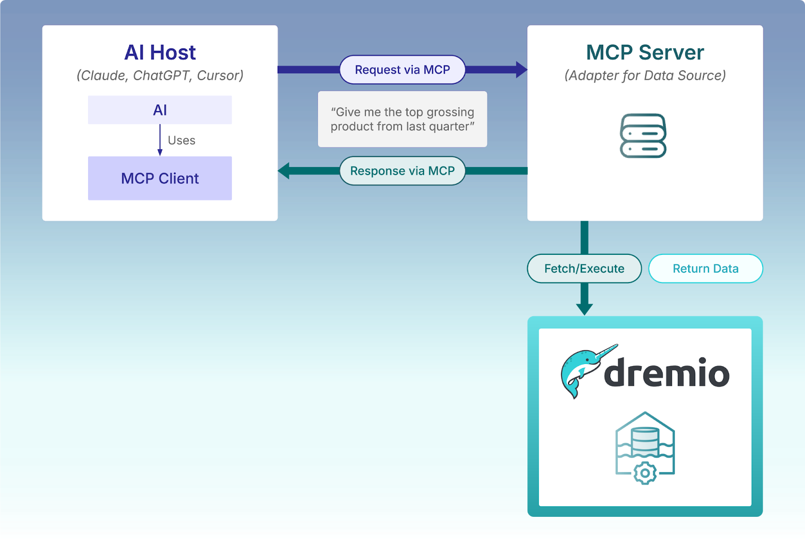

# The Importance of MCP

## What is MCP

Model Context Protocol (MCP) is an open, JSON-RPC-based protocol that standardizes the way any LLM client (an agent, IDE co-pilot, chatbot, etc.) can discover and use resources (read-only data), tools (functions that act), prompts (reusable templates) and sampling (server-initiated completions). There are some very compelling reasons for the introduction of the MCP:
- **Decouples Models from Everything Else**
    - Current frameworks hard-wire your code to a single LLM vendor and its quirks. MCP introduces a vendor-neutral "socket" so any model (OpenAI, Anthropic, local, or future) can be swapped in without refactoring tools, memory stores, or prompts.
- **Standardizes Context Handling**
    - Deciding what to feed a model is still an art and an error-prone one. MCP defines a common format for representing, filtering, and prioritizing context (task instructions, retrieved documents, and memory), turning ad-hoc prompt building into a predictable, testable layer.
- **Makes Tools Truly Plug-and-Play**
    - Today, a LangChain tool can't be dropped into a Semantic Kernel workflow. MCP specifies a universal schema for tool definitions, calls, and results, so any compliant agent or framework can invoke any compliant tool-with validation, logging, and fallback behavior baked in.
- **Improves Security and Governance**
    - Giving an agent the power to run shell commands or hit production APIs is risky. MCP embeds permissioning, human-in-the-loop approvals, and audited tool usage into the protocol, so organizations can grant fine-grained access without writing custom guards for every framework.
- **Enables Composable, Multi-Language Ecosystems**
    - Because MCP is a protocol, not a library, agents written in Python, TypeScript, or Rust and running on servers, edge devices, or browsers can cooperate. It's the "USB-C port" that lets heterogeneous components click together cleanly.
- **Makes Agent Behavior Observable and Debuggable**
    - By separating planning logic from execution and enforcing structured messages for "thought → action → observation," MCP produces a clear audit trail. Developers (and compliance teams) can see why an agent took each step and can replay or intervene when things go wrong.

MCP plays the same role for AI agents that the Apache Iceberg REST protocol plays for query engines: a universal, pluggable handshake between many clients and many back‑ends. MCP fills the gap left by today’s agent frameworks—providing the universal, secure, and interoperable layer that lets tools, memories, and models mix and match as easily as peripherals over USB‑C. That opens the door to more maintainable, portable, and trustworthy AI agents. 

## MCP Architecture

As seen in the image below (which refers to the Dremio MCP Server, discussed later in this course), the MCP has a simple and powerful architecture and each component plays an important role. The MCP communicates via JSON‑RPC 2.0 with an initialize-initialized handshake. Messages fall into four types: request, response, notification, and error. Note that MCP clients have a one-to-one relationship with MCP servers; however, multiple clients can be launched, which would spin up multiple MCP servers.



### Hosts

The host is the application that actually runs the language‑model session—your chat sidebar, IDE plug‑in, CLI wrapper, desktop agent, or web app. It is the top‑level environment where the user interacts with the LLM.

**Core Responsibilities**
- Model loop and UI – Sends user prompts to the LLM, streams tokens back to the screen, plays TTS, etc.
- Client management – Spins up one MCP client for every MCP server it wants to reach, keeps each connection alive, and routes messages.
- Policy enforcement – Decides whether an LLM‑initiated tools/call runs automatically or waits for human approval; handles redaction and PII stripping.
- Catalog presentation – Merges the resources and tools exposed by all connected servers, surfacing them in menus, palettes, or slash‑command lists.
- Logging and telemetry – Captures every JSON‑RPC frame for audit, replay, or analytics.

**Why Hosts Matter**
- They form the security boundary between the model and the outside world.
- They give users visibility and control over what the agent reads or does.
- By abstracting transport details (via clients), hosts let the same LLM workflow talk to local scripts today and cloud micro‑services tomorrow with zero prompt changes.

Think of the host as the operating system for your AI agent—responsible for display, permissions, and plumbing—so that servers can focus purely on business logic and data, and the LLM can focus purely on reasoning.

### Clients

A client is the lightweight connector that lives inside a host and handles the low‑level link to one—and only one—MCP server. It hides transport details (stdio, HTTPS/SSE, WebSocket, etc.) and turns raw bytes into clean JSON‑RPC frames the host and model can use.

**Core Responsibilities**
- Transport setup – Opens the stream (forks a process for stdio, negotiates TLS for HTTPS, etc.) and keeps it healthy with heartbeats or retries.
- Message framing – Encodes outgoing requests/notifications as JSON‑RPC; parses incoming responses/errors; maintains the request‑ID ↔ response map.
- Capability negotiation – Runs the initialize-initialized handshake, learns which features (resources, tools, sampling, and prompts) the server supports, and exposes that catalog upward.
- Security and authentication – Adds OAuth tokens, mTLS certs, or API keys; enforces size limits; base‑64‑wraps binary blobs.
- Back‑pressure and buffering – Queues requests while the transport reconnects; throttles streaming notifications so the host isn’t flooded.

**Why Clients Matter**
- Isolation – If one server crashes or misbehaves, only its client dies; the rest of the agent keeps running.
- Swap‑ability – Switching a server from local stdio to remote HTTPS is just a new client instance—no changes to host UI or LLM prompts.
- Polyglot freedom – Servers can be written in Python, Rust, C#, or Bash; the client presents a uniform JSON‑RPC interface regardless of the server’s implementation language.

Think of the client as the network card of an MCP host: it speaks the on‑the‑wire dialect, tracks sequence numbers, and surfaces a clean API. That leaves the host free to worry about UX and policy, the server to focus on business logic, and the LLM to focus on reasoning.

### Servers

The server is any program—local script, container, microservice, or SaaS gateway—that implements the MCP methods (resources/*, tools/*, prompts/*, sampling/*). It owns the real data and the real actions; everything else in the stack simply pipes requests to it.

**Core Responsibilities**
- Capability registry – Publishes a catalog of resources (read‑only data) and tools (callable functions), along with optional prompt templates.
- Business logic and data access – Executes shell commands, calls internal APIs, reads log files, talks to databases—whatever is needed to satisfy a request.
- Security enforcement – Validates every URI and tool argument against whitelists, strips secrets, applies authentication checks, and returns structured errors when rules are broken.
- Subscriptions and push events – Emits notifications/resources/updated or custom alerts so the client and host can stream live data to the model or UI.
- Sampling delegation – When a workflow needs the model’s help, it calls sampling/createMessage through the open channel instead of embedding an API key for a provider.

**Why Servers Matter**
- Single source of truth – Keeps all domain knowledge and side‑effects in one place.
- Modularity – You can add a new capability (e.g., deploy_to_staging tool) without modifying host code or model prompts.
- Language freedom – Write servers in Python, Go, Rust, Node, Bash—any language that can spit out JSON over a pipe or socket.
- Deployment flexibility – Run on a dev laptop for fast prototyping or behind a hardened gateway in production.

Think of the server as the muscle and memory of your AI system—it holds the data, runs the commands, and enforces the rules. Because MCP cleanly separates this layer from hosts and clients, you can evolve your backend logic or move it to a different stack without disturbing the LLM’s reasoning flow or the user’s experience.

### A Real World MCP

As an example, consider a virtual assistant for a park ranger — someone who needs to monitor changing weather, track wildlife sightings, and respond to emergencies in real time. Traditionally, creating such a system would mean gluing together weather APIs, local spreadsheets, geolocation data, and more — all through custom logic that only works for one setup.

However with MCP, you can build this assistant like a modular field kit.
- The weather server is like a dedicated radio in the ranger’s toolkit. It exposes tools like get-alerts and get-forecast, fetching data from the National Weather Service.
- A wildlife tracking server could expose a resource listing recent animal sightings from a local database.
- If a wildfire alert is triggered, a prompt might walk the ranger through filing an incident report.

The ranger (or the AI assistant they’re working with) simply launches Claude for Desktop with connected MCP servers. Ask, “What’s the weather forecast for tomorrow near Yosemite?” and the assistant knows exactly which tool to call and how to present the answer.

There is no need to pre-train the model on weather APIs or share raw data with third parties. Each tool is a standalone, swappable component, and the assistant becomes far more useful without adding complexity.

This is the power of MCP: it turns bespoke workflows into plug-and-play experiences for LLMs, making AI smarter by letting it access the right tool at the right time.

# Resources and Tools in MCP

The MCP relies on two complementary ideas—resources and tools—to turn a language model from a chat‑only companion into a safe, auditable agent that can both understand what is happening in your environment and, when permitted, take helpful action.

Resources are essential data sources that the model reads to gather insights about its environment. These resources can be log files, database entries, external APIs, or real-time data feeds. Each resource is uniquely identified by a URI, ensuring that the model can consistently access the specific resource, whether it is stored locally or in the cloud. Resources are interacted with through three primary API calls: resources/list to retrieve a catalog of available resources, resources/read to fetch the resource data, and resources/subscribe to receive real-time updates whenever the data changes. This setup ensures that the model has access to the latest information and can remain responsive to any changes in its environment.

Tools are the functions that enable the model to take action based on the data from resources. These tools can perform various tasks, such as restarting services, running shell commands, or summarizing data from a CSV file. Each tool is defined by a JSON schema, which outlines the exact parameters required to execute the tool. This schema acts as a contract to ensure that the inputs are valid and properly formatted, preventing errors or unsafe actions. Tools are accessed through two main API calls: tools/list, which retrieves a list of available tools, and tools/call, which executes a specific tool with the appropriate arguments. This structured approach ensures that the model only performs safe and controlled actions in response to the information it gathers.

The relationship between resources and tools is where the true power of MCP lies, creating a dynamic feedback loop. First, the model retrieves data from a resource—for example, it might read an error log to understand the state of a system. Based on the insights gained from that resource, the model then decides whether an action is required. If the situation calls for it, the model invokes a tool to act on that data—such as calling a restart_service tool to address a service failure. This feedback loop ensures that the model can make real-time decisions and take actions autonomously. Additionally, every interaction with resources and tools is logged, providing a complete, traceable audit trail for security and compliance purposes. This structure allows for continuous, intelligent decision-making and helps the model adapt quickly to changing circumstances.

# Message Lifecycle in MCP

## Message Format

MCP uses a language-agnostic JSON-RPC 2.0 message format to communicate between clients and servers so that all communication flows through a structured lifecycle. The handshake sets capabilities, the transport can be stdio or HTTP/SSE, and every interaction—resource read, tool call, prompt fetch, sampling request—travels as a typed JSON‑RPC message the moment either side needs it.

## Initialize - Initialized Handshake

**Initialize (request):** The client opens the transport stream and sends one JSON‑RPC request with its MCP version and a list of capabilities it would like to use (e.g., ["resources", "tools", "sampling"]). This frames the connection and prevents mismatched protocol versions later.

**Initialize (response):** The server responds to the same ID, confirming the MCP version it speaks and the exact capabilities it is willing to expose—possibly a subset of what was requested. The result may include limits or metadata (max blob size, auth realm, etc.), allowing graceful feature negotiation.

**Initialized (notification):** The client sends an initialized notification, a one‑way JSON‑RPC notification (without an ID), telling the server “handshake complete—start regular traffic whenever you’re ready." From this moment on, either side can send any method (resources/*, tools/*, sampling/*, etc.) as standard JSON‑RPC messages.

## Message Types

MCP relies on the four primitives defined by JSON‑RPC 2.0 and everything is sent in plain JSON text with binary data base-64 encoded. This means that asynchronous, bidirectional traffic appears naturally (requests out, responses/error back, notifications both ways), giving LLM agents the responsive, event‑driven feel of a real operating system.
- **Request**
    ```
    Ask the other side to do something and expect a reply that matches the ID.

    Example: {id: 7, method: "tools/call", params:{…}} 
    ```
- **Response**
    ```
    The answer to a request—either the data you wanted (result) or an error message. Exactly one result or error will appear in a response.

    Examples: 
    {id: 7, result:{…}}
    {id: 7, error:{…}}
    ```
- **Notification**
    ```
    Tell the other side something without waiting for a reply (fire‑and‑forget).

    Example: {method:"notifications/resources/updated", params:{…}}
    ```
- **Error**
    ```
    Explains why a request failed. No result appears when error is present. Exactly one result or error will appear in a response.

    Example part of a response: error:{code:‑32601, message:"Method not found"}
    ```

## Message Transport

MCP supports multiple transport mechanisms so that you can change the piping without touching agent code.
- **stdio:** The client launches the server as a child process and swaps JSON on stdin and stdout. This setup is ideal for local scripts, quick prototypes, and development tools. It offers the fastest (sub‑millisecond) and zero network overhead, but the server terminates when the parent process exits.
- **HTTP + SSE:** The client sends each request as a POST to the server’s HTTP endpoint. The server pushes responses and notifications back over a long‑lived Server‑Sent‑Events (SSE) stream. This approach is well-suited for cloud functions, SaaS gateways, and services behind load balancers or firewalls. It's easy to secure with TLS and can reuse existing infrastructure.
- **WebSocket / gRPC / anything:** A single duplex socket carries the same JSON text frames. (Not part of the MCP 1.0 specification, but fully compatible.) This is ideal for real‑time dashboards, mobile apps, or whenever you want low‑latency, bidirectional traffic over a single TCP connection.